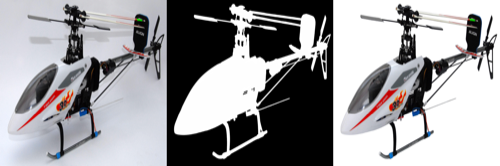
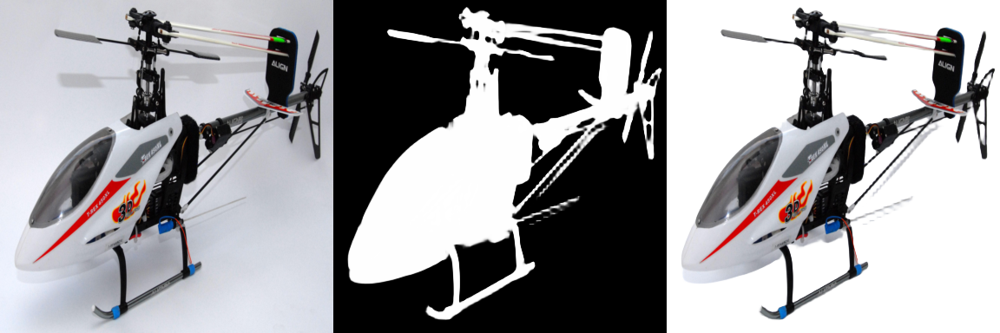
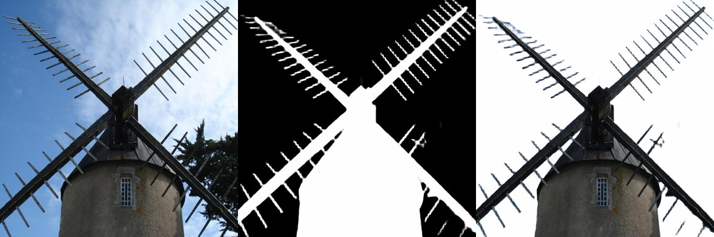
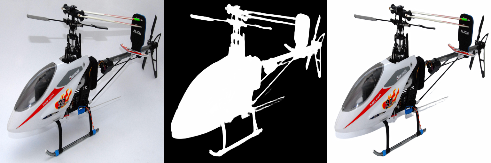
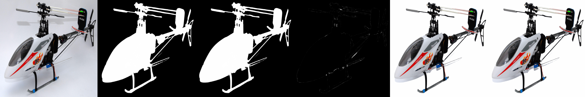

# candle-birefnet

[BiRefNet](https://github.com/ZhengPeng7/BiRefNet) (Bilateral Reference Network) inference for [Hugging Face Candle](https://github.com/huggingface/candle).

Pure Rust, no custom kernels — works on all Candle backends (CPU, CUDA, Metal, WASM).

## Supported Models

| Model | Backbone | Weights | Constructor |
|-------|----------|---------|-------------|
| [BiRefNet](https://huggingface.co/ZhengPeng7/BiRefNet) | Swin-V1-Large | 444 MB (FP16) | `BiRefNet::new(vb)` |
| [BiRefNet_lite](https://huggingface.co/ZhengPeng7/BiRefNet_lite) | Swin-V1-Tiny | 178 MB (FP32) / 85 MB (FP16) / **43 MB (INT8)** | `BiRefNet::new_lite(vb)` |

INT8 weights use PyTorch Post-Training Quantization with DUTS-TE calibration. See [INT8 Quantization Guide](docs/INT8_QUANTIZATION.md) for details.

## Results

PyTorch (left) vs **Candle/Rust** (right). Each panel shows: Input | Segmentation Mask | Composite.

*Sample images from [BiRefNet demo](https://huggingface.co/spaces/ZhengPeng7/BiRefNet_demo).*

### BiRefNet (Swin-V1-Large)

Using [`ZhengPeng7/BiRefNet`](https://huggingface.co/ZhengPeng7/BiRefNet) pretrained weights.

#### 1024x1024

| PyTorch | Candle (Rust) |
|---------|---------------|
|  |  |
|  |  |

#### 384x384

| PyTorch | Candle (Rust) |
|---------|---------------|
|  |  |
|  |  |

### BiRefNet_lite (Swin-V1-Tiny)

Using [`ZhengPeng7/BiRefNet_lite`](https://huggingface.co/ZhengPeng7/BiRefNet_lite) pretrained weights.

#### 1024x1024

| PyTorch | Candle (Rust) |
|---------|---------------|
|  |  |
|  |  |

#### 384x384

| PyTorch | Candle (Rust) |
|---------|---------------|
|  |  |
|  |  |

### BiRefNet_lite INT8 (Quantized, 43 MB)

FP32 (top) vs **INT8 dequantized** (bottom) at 512x512. Each panel shows: Input | Segmentation Mask | Composite.

| FP32 | INT8 |
|------|------|
|  |  |
|  |  |

FP32 vs INT8 difference (amplified 10x):

| Helicopter | Windmill |
|------------|----------|
|  |  |

*Comparison panels: Input \| FP32 Mask \| INT8 Mask \| Diff(10x) \| FP32 Composite \| INT8 Composite*

## Architecture

Configurable Swin-V1 backbone + ASPPDeformable decoder.

Depends on:
- [candle-swin](https://github.com/developer0hye/candle-swin) — Swin Transformer V1 backbone
- [candle-dcnv2](https://github.com/developer0hye/candle-dcnv2) — Deformable Convolution V2

## Quick Start

```bash
# BiRefNet (Swin-V1-Large, default)
cargo run --example inference --release -- --image your_image.jpg --size 1024

# BiRefNet_lite (Swin-V1-Tiny, smaller & faster)
cargo run --example inference --release -- --image your_image.jpg --size 1024 --lite
```

### As a library

```rust
use candle_core::{Device, DType, Tensor};
use candle_nn::VarBuilder;
use candle_birefnet::BiRefNet;

let device = &Device::Cpu;
let vb = unsafe {
    VarBuilder::from_mmaped_safetensors(&["model.safetensors"], DType::F32, device)?
};

// Swin-V1-Large (default)
let model = BiRefNet::new(vb)?;

// Or Swin-V1-Tiny (lite)
// let model = BiRefNet::new_lite(vb)?;

// Input: [B, 3, H, W] ImageNet-normalized RGB tensor
let outputs = model.forward(&input)?;
// outputs[0]: [B, 1, H, W] segmentation logits (apply sigmoid for mask)
```

## Validation

End-to-end inference output matches PyTorch BiRefNet:

| Model | Format | Resolution | Max Error | Mean Error | IoU vs FP32 |
|-------|--------|-----------|-----------|------------|-------------|
| BiRefNet (Swin-L) | FP32 | 384x384 | 6.87e-5 | — | — |
| BiRefNet (Swin-L) | FP32 | 1024x1024 | 1.63e-4 | — | — |
| BiRefNet_lite (Swin-T) | FP32 | 384x384 | 5.15e-5 | — | — |
| BiRefNet_lite (Swin-T) | **INT8 PTQ** | 512x512 | 2.04e-1 | 3.75e-4 | **0.9986** |

INT8 quantized with [DUTS-TE](https://saliencydetection.net/duts/) calibration (500 images). See [INT8 Quantization Guide](docs/INT8_QUANTIZATION.md).

## Note on candle-core Conv2d Bug

This project uses a [patched candle-core](https://github.com/developer0hye/candle/tree/fix/conv2d-tiled-bug) that works around a `conv2d_tiled` bug ([huggingface/candle#3404](https://github.com/huggingface/candle/issues/3404)). The patch switches the default Conv2d implementation from `TiledIm2Col` to `FullIm2Col`. Once the upstream fix is merged, this project will switch back to the official candle release.

## Reference

- [BiRefNet: Bilateral Reference for High-Resolution Dichotomous Image Segmentation](https://arxiv.org/abs/2401.03407)

## License

Apache-2.0
